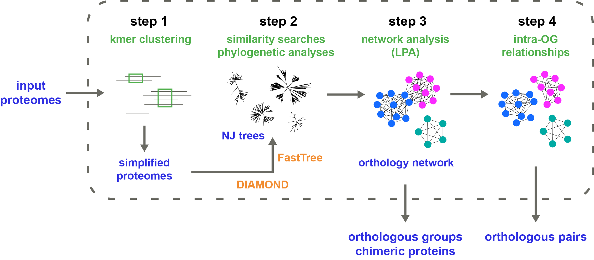

<p align="center">
  
</p>

## THIS IS A MODIFIED VERSION OF BROCCOLI
Whilst the original functionality of broccoli remains the same, this version has the option to run step2 in two separate sub steps
This was done to allow the phylome building to be run as separate jobs. In the context of a using broccoli in an HPC environment this can be useful.
The original intention was to allow the tree building and diamond searches to be run as many independent jobs in a nextflow pipelie on an HPC.
If you are not interesting in upscaling broccoli in this way, then just use the original Broccoli.
If you are interested in using this version of Broccoli see https://github.com/dmckeow/crg-bcaortho where it has been implemented in nextflow

The changes made were as follows:
* 3 functions added to broccoli_step2.py which are just the step2_phylomes function split into 2, and a modified multiprocessing function.
* 1 function added to utils.py to pickle objects slightly differently
* 2 new commandline arguments were added, sub_step2_input and sub_step2 which allow the sub steps of 2 to be run separately

```python
# Run step 1 as in the original Broccoli
python3 broccoli.py -dir input -steps 1

# Run step 2 part 1 - it just prepares the folders and diamond dbs
# This is only slightly altered from the original Broccoli, as it is already very quick as a multiprocess
# It has merely been split from the rest of step 2
# An important thing it does is it pickles the input tuples for the step2 part 2
python3 broccoli.py -dir input -steps 2 -sub_step 1

# Run step 2 part 2
# In dir_step2 there is one pickle file per input proteome, i.e. dir_step2/files_start_*.pic
# Part 2 must be run by providing **one** of them via -sub_step2_input
# The purpose of this is that it allows you to submit independent jobs for every file
# Each runs the phylome building step exactly the same as in the original broccoli
# In each process, one of the input proteomes is blasted against all others in the input dataset
# If this step is run with threads, the threading will still be used, but across that single single-vs-all process as opposed to being shared by all-vs-all processes
# I did this allow my nextflow pipeline to iterate over all the dir_step2/files_start_*.pic files, submitting simultaneous jobs for each one on the HPC

python3 broccoli.py -dir input -steps 2 -sub_step 2 -sub_step2_input dir_step2/files_start_0.pic

# Run steps 3,4 as in the original Broccoli
# This will be incomplete if every dir_step2/files_start_*.pic is not run with step 2 part 2
python3 broccoli.py -dir input -steps 3,4
```

## Overview

Broccoli is designed to infer with high precision orthologous groups and pairs of proteins using a mixed phylogeny-network approach. Briefly, Broccoli performs ultra- fast phylogenetic analyses on most proteins and builds a network of orthologous relationships. Orthologous groups are then identified from the network using a parameter-free machine learning algorithm (label propagation). Broccoli also detects chimeric proteins resulting from gene-fusion events and assigns these proteins to the corresponding orthologous groups.

__Reference:__ <a href="https://academic.oup.com/mbe/advance-article/doi/10.1093/molbev/msaa159/5865275">Broccoli: combining phylogenetic and network analyses for orthology assignment</a>

<p align="center">
  
</p>


## Requirements
To run Broccoli, you need (see the [**manual**](manual_Broccoli_v1.2.pdf) for installation advices):
- a Unix system (MacOS or Linux)
- Python version 3.6 or above
- <a href="https://github.com/etetoolkit/ete">ete3 library</a>
- <a href="https://github.com/bbuchfink/diamond">Diamond</a> version 0.9.30 or above
- <a href="http://www.microbesonline.org/fasttree/">FastTree</a> version 2.1.11 or above (**single-thread version**)


## Running Broccoli
All parameters and options are available using the `-help` argument (see also the [**manual**](manual_Broccoli_v1.2.pdf) for more details):
```
python broccoli.py -help
```
To test Broccoli with the small example dataset present in the directory `example_dataset` (30 sec to 1mn):
```
python broccoli.py -dir example_dataset
```
Broccoli will store the temporary and output files in 4 directories named `dir_step1` to `dir_step4` (one for each step) located in the current directory.


## Licence
This program is free software; you can redistribute it and/or modify it under the terms of the GNU General Public License as published by the Free Software Foundation; either version 3 of the License, or (at your option) any later version.

This program is distributed in the hope that it will be useful, but WITHOUT ANY WARRANTY; without even the implied warranty of MERCHANTABILITY or FITNESS FOR A PARTICULAR PURPOSE. See the GNU General Public License for more details.

You should have received a copy of the GNU General Public License along with this program. If not, see http://www.gnu.org/licenses/.

See "LICENSE" for full terms and conditions of usage.
